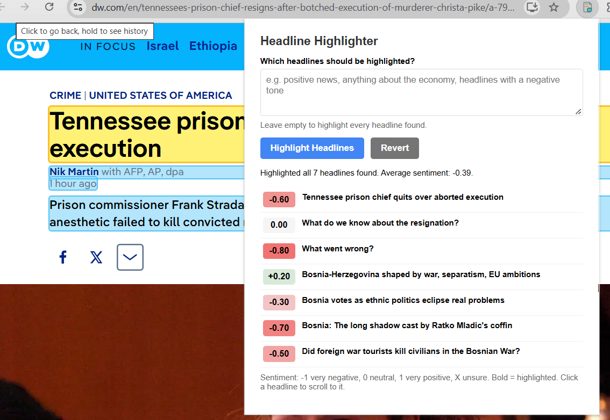

# Headline Highlighter

A Chrome extension that finds the headlines on a page, scores each one's
sentiment from **-1** (very negative) through **0** (neutral) to **+1** (very
positive), or **X** when unsure, and highlights the ones that match a
description you type, such as "positive news" or "anything about the economy".

Everything runs on your computer using Chrome's built-in **Gemini Nano** model
(the Prompt API). No API key is needed and nothing is sent to a server.

## Example



## Requirements

- Desktop Chrome 138 or newer
- About 22 GB of free disk space for the model
- A GPU with more than 4 GB of video memory, or 16 GB of RAM
- An unmetered network connection for the one-time model download

## Install

### Never added an extension before? Start here

This extension isn't in the Chrome Web Store, so you load it straight from a
folder on your computer ("unpacked"). It takes about two minutes.

1. **Get the files.** Put this whole folder (`sentiment`, containing
   `manifest.json`, `popup.html`, `popup.js`, `content.js` and `icon.png`)
   somewhere on your computer, such as `C:\Users\<you>\ml\sentiment`. If you
   received it as a `.zip` file, right-click it and choose **Extract All**
   first. Chrome can't load a zip file.
2. **Open Chrome.** Use desktop Chrome, version 138 or newer. To check, go to
   the **⋮** menu (top right) → **Help** → **About Google Chrome**.
3. **Open the extensions page.** Type `chrome://extensions` in the address
   bar and press Enter. You can also use **⋮** → **Extensions** → **Manage
   Extensions**.
4. **Turn on Developer mode.** Click the **Developer mode** toggle in the top
   right corner of the page. Three new buttons appear on the left: **Load
   unpacked**, **Pack extension** and **Update**.
5. **Load the extension.** Click **Load unpacked**. In the folder picker,
   open the folder you saved in step 1 so you can see `manifest.json` inside
   it, then click **Select Folder**.
   - If you get "Manifest file is missing or unreadable", you picked the
     wrong folder, often the one above it. Pick the folder that directly
     contains `manifest.json`.
6. **Check it loaded.** A card called **Headline Highlighter** appears on
   the page and its toggle should be blue (on). If there's a red **Errors**
   button on the card, click it to see what went wrong.
7. **Pin it to the toolbar.** Click the **puzzle-piece icon** to the right
   of the address bar, find **Headline Highlighter**, and click the **pin**
   next to it. Its icon now sits in your toolbar.
8. **Try it.** Open a news website, click the extension's icon, and click
   **Highlight Headlines**. The first time, Chrome may need to download the
   Gemini Nano model. If nothing seems to happen, see
   [Nothing is happening?](#nothing-is-happening) below.

Good to know:

- Keep the folder where it is. Chrome loads the extension from that folder
  every time it starts, so moving or deleting the folder breaks it. If you
  move it, remove the extension and load it again from the new place.
- Chrome may show a "Disable developer mode extensions" warning when it
  starts. That's normal for unpacked extensions. Click the **X** or **Keep**
  to dismiss it.
- To remove the extension, go to `chrome://extensions` and click **Remove**
  on its card.

### Already know how?

1. Go to `chrome://extensions`.
2. Turn on **Developer mode** (top right).
3. Click **Load unpacked** and select this folder.
4. Pin the extension from the puzzle-piece menu in the toolbar.

After editing any file, click the reload icon on the extension's card in
`chrome://extensions`, then reload the page you are testing on.

## Use

1. Open a news page, for example a newspaper's front page.
2. Click the extension icon.
3. Optionally type which headlines you want highlighted. Leave the box empty
   to highlight every headline.
4. Click **Highlight Headlines**.
   - Matching headlines are highlighted in **yellow** on the page, and their
     story text in **light blue**.
   - The popup lists every headline with its sentiment score. Bold rows are the
     highlighted ones. Click a row to scroll to that headline.
5. Click **Revert** to remove the highlights.

## How it works

- **What counts as a headline:** `content.js` looks at `h1`–`h4` tags and
  elements marked as headlines (`itemprop="headline"`, or "headline" in the
  class name). It skips menus and footers, hidden elements, duplicates, and
  very short labels. A headline must also have **associated text**: the
  content that follows it, up to the next headline, has to include at least 5
  words that aren't links. This filters out menus and page headers.
- **Scoring:** `popup.js` sends the headlines to Gemini Nano 10 at a time,
  each with the first 250 characters of its story text. The model must reply
  in a fixed JSON format with a sentiment score, an "unsure" flag (shown as X)
  and a match decision for each headline. Results appear in the popup as each
  group finishes.

# Nothing is happening?

The usual cause is that the Gemini Nano model hasn't been downloaded yet.
Chrome doesn't download it in advance. It only starts when a page or
extension asks for the model after you click something, and sometimes it
doesn't start at all until you force it.

## 1. Check whether the model is downloaded

Go to `chrome://on-device-internals`, open the **Broker State** tab, and look
at the **Models** table.

- **A real Folder Size and a Weights Path** means it's downloaded. Skip to
  step 4.
- **Every model showing `0 MiB` with no weights path** means nothing has been
  downloaded. Carry on with step 2.

The **Event Logs** tab only records events while it's open. Keep it open in
one tab while you try things in another.

## 2. Turn on the flags

Go to `chrome://flags`, set these, then click **Relaunch**:

| Flag | Setting |
| --- | --- |
| `#optimization-guide-on-device-model` | Enabled BypassPerfRequirement |
| `#prompt-api-for-gemini-nano` | Enabled |
| `#summarization-api-for-gemini-nano` | Enabled |

## 3. Force the download

Open the browser console on any normal web page: open a site such as a news
page (not a `chrome://` page), press **F12**, and go to the **Console** tab.
Then drop this in:

```js
document.addEventListener("click", async () => {
  console.log("Availability:", await LanguageModel.availability());
  const s = await LanguageModel.create({
    monitor(m) {
      m.addEventListener("downloadprogress", (e) =>
        console.log(`Downloaded ${Math.round(e.loaded * 100)}%`)
      );
    },
  });
  console.log("Model ready!", s);
}, { once: true });
```

Then **click anywhere on the page**. Chrome only starts the download after a
real click, and typing in the console doesn't count, which is why the code
waits for one.

- If Chrome won't let you paste, type `allow pasting`, press Enter, and paste
  again.
- The console prints the availability, then download percentages, then
  "Model ready!". The download is several GB, so leave Chrome open until it
  finishes. You can also watch the **Folder Size** grow on the **Broker
  State** tab (refresh the page to update it).

Alternatively, go to `chrome://components`, find **Optimization Guide On
Device Model**, and click **Check for update**.

## 4. Reload and try again

Once the model has downloaded, reload the extension at `chrome://extensions`,
reload the page, and click **Highlight Headlines**.

## What the messages mean

| Message | Meaning |
| --- | --- |
| `"available"` | The model is ready. |
| `"downloadable"` | The model isn't downloaded yet. Chrome will fetch it once something asks for it after a click (see step 3). |
| `"downloading"` | The download is in progress. Wait and check the Broker State tab. |
| `"unavailable"` | Chrome won't run the model on this device. Check disk space, the flags in step 2, and `chrome://policy` for admin policies. |
| `LanguageModel is not defined` | The Prompt API isn't switched on. Check the flags in step 2 and your Chrome version. |
| "No headlines found on this page." | The model is fine, but no headlines with associated text were found on this page. |

To see detailed errors from the extension itself, right-click inside the
popup, choose **Inspect**, and open the **Console** tab.
